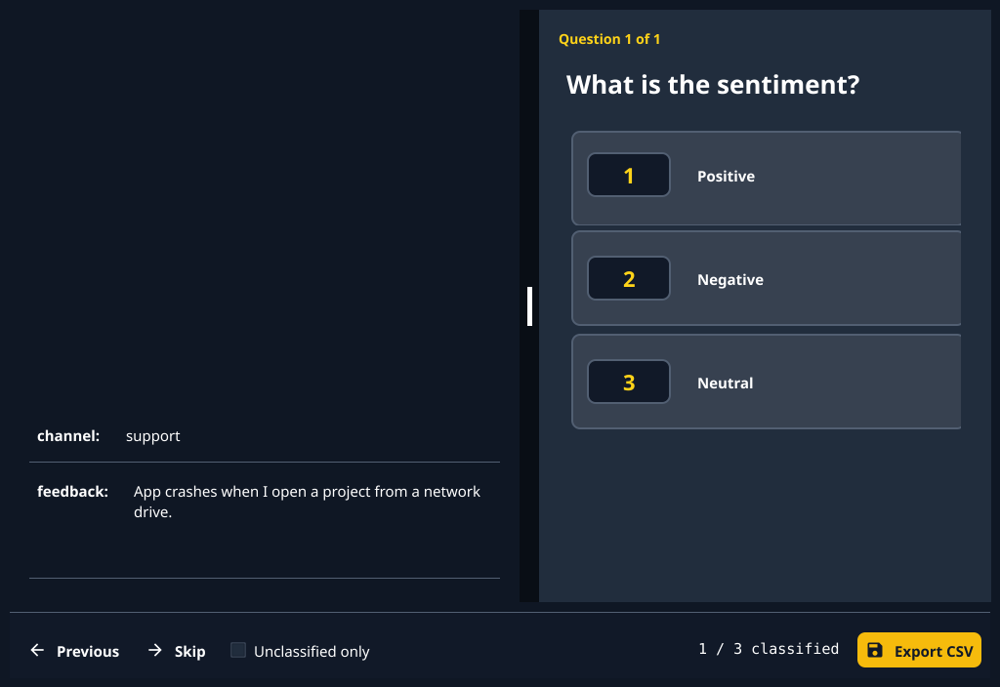
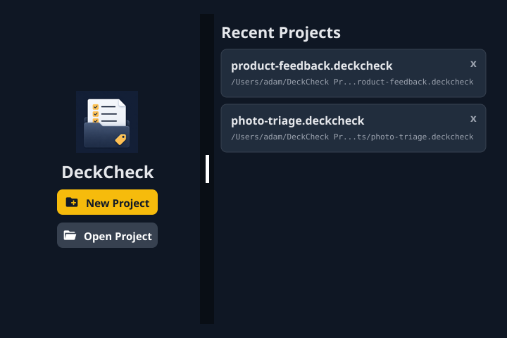
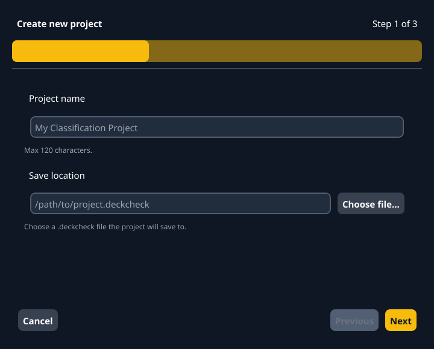

# DeckCheck

[](https://github.com/adambrett/deckcheck/actions/workflows/ci.yml)
[](LICENSE)

DeckCheck is a local-first desktop app for fast, question-based classification over folders of images and CSV rows. It is built for small dataset triage jobs where you need repeatable human judgment, keyboard-first navigation, and a clean CSV export without setting up an annotation platform.



<details>
<summary>More screenshots: launcher and new-project wizard</summary>





</details>

Screenshots are software-rendered straight from the real views; regenerate with `make screenshots`.

## Features

- Create one-file `.deckcheck` projects (DuckDB under the hood) that store the dataset, questions, answers, and classifications.
- Import plain CSV files, folders of images, or CSV files with an image path column.
- Define one or more multiple-choice or image-grid questions per project.
- Classify quickly with number keys, previous/next navigation, skip, and an unclassified-only mode.
- Export the original rows plus classification answers, grid cell selections, and selected cell pixel bounds as a CSV.

## Installation

Download the latest packaged app for your platform from [GitHub Releases](https://github.com/adambrett/deckcheck/releases):

- **macOS (Apple Silicon)**: `deckcheck-darwin-arm64.zip`
- **Linux (x86_64)**: `deckcheck-linux-amd64.tar.xz`
- **Windows (x86_64)**: `deckcheck-windows-amd64.zip`

### Build from source

Install Go and the native dependencies required by [Fyne](https://docs.fyne.io/started/), then run:

```bash
git clone https://github.com/adambrett/deckcheck.git
cd deckcheck
make build
```

The binary is written to `bin/DeckCheck`.

## Usage

Run the app from source:

```bash
make run
```

Create a project:

1. Choose **New Project**.
2. Pick a `.deckcheck` file path for the project database.
3. Select a dataset type: CSV file, image folder, or CSV with image references.
4. Add one or more questions with comma-separated possible answers, or choose an image grid question for cell-based annotations.
5. Classify each record and export the completed dataset with **Export CSV**.

Keyboard shortcuts:

- `1`-`9`: choose the matching answer for the active question.
- `Left`: go to the previous record.
- `Right`: skip to the next record.

Mouse/clicking answers also works if that's preferred.

## Development

Common commands:

```bash
make test              # Run unit and integration tests
make unit-test         # Run untagged tests (pure domain, no Fyne driver)
make integration-test  # Run integration-tagged widget/UI tests
make lint              # Run golangci-lint
make fmt               # Format Go source
make run-website       # Serve the static website locally
make package           # Package the app for the current OS
```

The app entrypoint is `cmd/gui/deckcheck`; the UI layer lives in `internal/ui`. Core domain types live in `internal/project` and `internal/dataset`; `.deckcheck` project-file persistence lives in `internal/projectfile` with schema migrations in `internal/db`.

## Support

Use [GitHub Issues](https://github.com/adambrett/deckcheck/issues) for bug reports, feature requests, and support questions.

## Contributing

Pull requests are welcome. For larger changes, please open an issue first so the approach can be discussed before implementation.

Before opening a pull request, run:

```bash
make fmt
make test
```

For the test architecture, screen-flow coverage, and release smoke checks,
follow the [testing guide](docs/testing.md).

## License

Source-available under the [BSD-3-Clause license with the Commons
Clause condition](LICENSE): you can use, modify, and redistribute
DeckCheck freely, but not sell it (including paid hosting or support
built on it).
